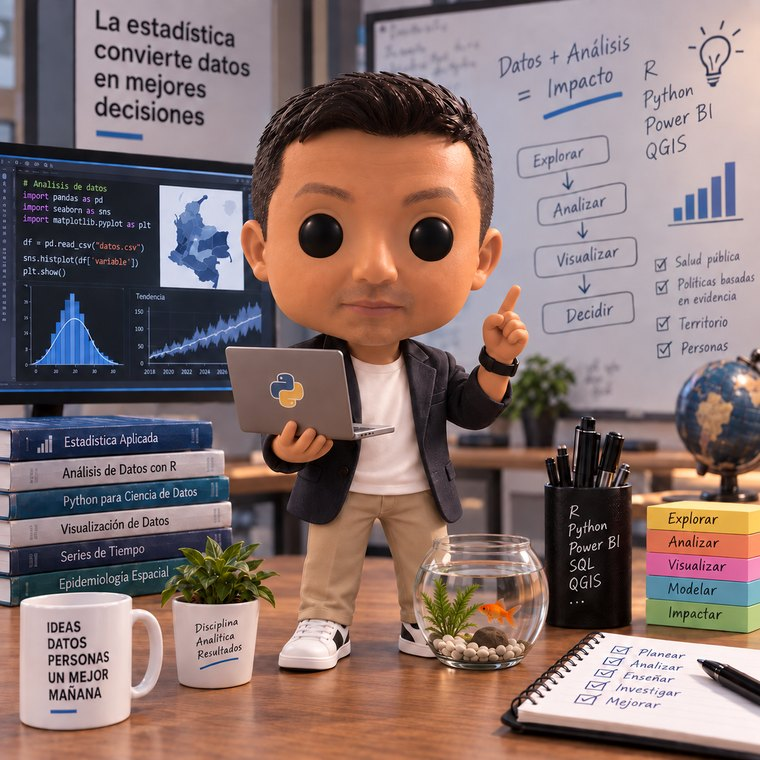

```{=html}
<div class="ix-docente" style="align-items:flex-start">
  
  <div class="txt">
    <div class="rol">Docente del espacio académico</div>
    <div class="nom" style="font-size:1.45rem">Wilson Sandoval Rodríguez</div>
    <p style="font-size:.95rem">
      Estadístico. Trabaja en gestión territorial de datos en salud y enseña
      análisis estadístico y ciencia de datos en programas de pregrado y
      posgrado en Bogotá.
    </p>
  </div>
</div>
```

## Desde dónde está escrito este curso

Este material no se construyó desde la teoría jurídica hacia los datos, sino al
revés. Las preguntas que organizan el curso son las que aparecen en la práctica
profesional cuando alguien tiene una base delante, un plazo encima y una
decisión que tomar:

- ¿De dónde salieron estos datos y para qué se recogieron?
- ¿Puedo usar todas las variables que tengo disponibles?
- ¿Qué pasa si el modelo mejora usando una variable que preferiría no usar?
- ¿Qué entrego cuando me piden «la base, pero anonimizada»?

La experiencia que hay detrás combina tres cosas que no suelen ir juntas: la
producción de estadística pública, donde los datos describen a personas que no
pueden irse a otro proveedor; el trabajo con información territorial y de salud,
donde el dato sensible no es una hipótesis de aula; y la docencia en programas
de analítica, donde el estudiante llega sabiendo modelar y sin haberse
preguntado nunca si debía.

## Qué esperar del curso

::: {.rds-card .decide data-label="CÓMO TRABAJAMOS"}
**No se memorizan artículos.** La norma aparece cuando hace falta para resolver
un problema, y siempre está a un clic en el
[Marco legal](marco-legal/index.qmd).

**Se decide y se defiende.** Cada caso y cada laboratorio terminan pidiendo una
decisión argumentada, no una respuesta correcta.

**Se mide.** Cuando una afirmación puede convertirse en un número —cuántas
personas quedan expuestas, cuánto desempeño se pierde, sobre quién se equivoca
el modelo— se calcula en vez de opinar.

**Se documenta.** Una decisión sin evidencia no cuenta como decisión. Es la
regla que atraviesa las cuatro actividades evaluativas.
:::

## Áreas de trabajo

| | |
|:--|:--|
| **Estadística aplicada** | Análisis multivariado, series de tiempo, regresión, análisis exploratorio de datos espaciales. |
| **Datos en salud pública** | Indicadores de talento humano en salud, gestión territorial, emergencias y desastres. |
| **Ciencia de datos** | Python, R, Power BI, SQL, QGIS. Automatización de procesos de datos y tableros analíticos. |
| **Docencia** | Programas de pregrado y posgrado en análisis estadístico y ciencia de datos. |

## Contacto y materiales

El repositorio del curso es público y se actualiza durante el semestre. Si
encuentra un error —en el código, en una cifra o en una referencia normativa—
señalarlo es bienvenido y cuenta como participación.

```{=html}
<div class="ix-acciones">
  <a class="ix-btn principal" href="https://github.com/wilsonsr/leyes-etica-proteccion-datos" target="_blank" rel="noopener">
    <span class="ico">◇</span> Repositorio del curso
  </a>
  <a class="ix-btn" href="https://github.com/wilsonsr/leyes-etica-proteccion-datos/issues" target="_blank" rel="noopener">
    <span class="ico">!</span> Reportar un error del material
  </a>
  <a class="ix-btn" href="https://github.com/wilsonsr" target="_blank" rel="noopener">
    <span class="ico">@</span> Otros cursos
  </a>
</div>
```

::: {.callout-note}
## Sobre la imagen

La ilustración de esta página es una representación estilizada, no una
fotografía. Aparece aquí y en un bloque pequeño de la portada; el resto del
sitio está dedicado al contenido del curso.
:::

**Siguiente paso:** [Las tres unidades del curso](unidades.qmd)
